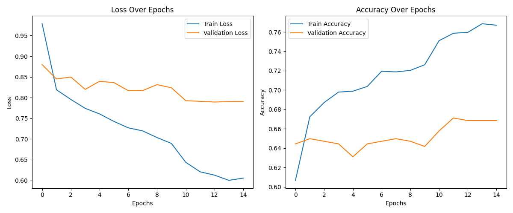

# Using HuggingFace Framework's `tweet_eval` Dataset for Multinomial Classification

<strong><a href="https://kedion.medium.com/fine-tuning-nlp-models-with-hugging-face-f92d55949b66">Click Here for the Source Tutorial that I followed</a></strong>

- ## <strong style="color: teal">1.</strong> Preparing the Data, the Model, and the Tokenizer

  The <a href='https://huggingface.co/datasets/tweet_eval'><u>TweetEval Dataset</u></a> is a dataset from the <em>HuggingFace</em> organization that is intended for multinomial (aka multi-class) classification.

  ### <strong style="color: magenta">A.</strong> Start by installing the `datasets` library in the terminal using `pip`:

  ```bash
  $ pip install datasets
  ```

  - This will also install the `transformers` library.

  <hr>

  ### <strong style="color: magenta">B.</strong> Import the necessary packages:

  - #### We need:

    1. Two classes from the `transformers` package:
       - AutoTokenizer
       - TFAutoModelForSequenceClassification
    2. One function from the `datasets` package:
       - load_dataset
    3. `tensorflow` package
    4. `numpy` package

  ```py
  from transformers import AutoTokenizer, TFAutoModelForSequenceClassification
  from datasets import load_dataset
  import tensorflow as tf
  import numpy as np
  ```

  <hr>

  ### <strong style="color: magenta">C.</strong> Load the `tweet_eval` dataset using the function from the `datasets` library:

  ```py
  tweet_dataset = load_dataset(path="tweet_eval", name="emotion")
  ```

  - `path` is the URL to the dataset
  - `name` is the configuration of the dataset. For the purpose of this assignment, we are using the `emotion` configuration
    - This configuration is intended to help identify emotion or sentiment based on the content of tweets

  <hr>

  ### <strong style="color: magenta">D.</strong> Instantiate the DistilBERT Model and its Tokenizer:

  ```py
  tokenizer = AutoTokenizer.from_pretrained('distilbert-base-uncased')
  model = TFAutoModelForSequenceClassification.from_pretrained('distilbert-base-uncased', num_labels=4)
  ```

  - We use <em>auto classes</em> for our model and tokenizer (which we imported up top)

    - As a result, we need only pass the name of our model as a parameter

  #### <strong>We are now finished with the preparatory phase!</strong>

  Let's see what we have so far, and add a `print` statement to inspect our dataset:

  ```py
  from transformers import AutoTokenizer, TFAutoModelForSequenceClassification
  from datasets import load_dataset
  import tensorflow as tf
  import numpy as np

  tweet_dataset = load_dataset(path='tweet_eval', name='emotion')
  tokenizer = AutoTokenizer.from_pretrained('distilbert-base-uncased')

  model = TFAutoModelForSequenceClassification.from_pretrained('distilbert-base-uncased', num_labels=4)

  print(tweet_dataset)  # print statement for inspecting dataset thus far
  ```

  Running the above code gives the <em style="font-family: Courier">console output </em>:

  ```
  DatasetDict({
    train: Dataset({
        features: ['text', 'label'],
        num_rows: 3257
    })
    test: Dataset({
        features: ['text', 'label'],
        num_rows: 1421
    })
    validation: Dataset({
        features: ['text', 'label'],
        num_rows: 374
    })
  })
  ```

<br>
<hr>
<br>

- ## <strong style="color: teal">2.</strong> Data Preprocessing

  - `DatasetDict` is the `dict` object representation of our dataset. It contains the data splits of our dataset:

  - Each element of `DatasetDict` is a `Dataset` object

  - We use `Dataset` objects to represent our `train`, `test`, and `validation` sets. Each `Dataset` contains two elements:

    1. `features`: a `list` object containing two elements:
       1. `text`: the full set of tweets for this `Dataset` object
       2. `label`: the set of category labels corresponding to the `text` tweet set
    2. `num_rows`: the number of rows in this `Dataset` object

  - We can output a specific set by indicating which element of the array containing that set we want to print.

  Let's change our print statement:

  ```py
  print(tweet_dataset['train']) # new print statement
  ```

  which gives the <em style="font-family: Courier">console output</em> :

  ```
  Dataset({
    features: ['text', 'label'],
    num_rows: 3257
  })
  ```

  And now let's output the first two tweets (from the `train` set) and their respective category labels:

  ```py
  # print(tweet_dataset['train']) # new print statement

  print(f"Sequence samples:\n {tweet_dataset['train']['text'][:2]}")
  print(f"Label samples:\n {tweet_dataset['train']['label'][:2]}")
  ```

  The above code <em style="font-family: Courier">outputs</em> :

  ```
  Sequence samples:
  ["“Worry is a down payment on a problem you may never have'. \xa0Joyce Meyer.  #motivation #leadership #worry", "My roommate: it's okay that we can't spell because we have autocorrect. #terrible #firstworldprobs"]
  Label samples:
  [2, 0]
  ```

  As of right now, the labels are only in numeric form (which is good, because we won't need to convert them later for training)

  - However, we do want to have corresponding string labels for these numeric values, for sake of convenience and interpretability when outputting. Let's do that now:

  ```py
  class_names = {0: "anger", 1: "joy", 2: "optimism", 3: "sadness"}
  ```

  - We also want to find the length of the longest sequence of words in the dataset, so that we can then pass that data to TF Tensors in order to ensure that our sequences match in length
    - Additionally, extending beyond the length of the longest sequence is unnecessary
  - We'll retrieve the length of the longest sequence in each of the data 'splits' by defining a simple `find_max_length` function (We'll define this in a new file called <em style="font-family: Courier">functions.py</em>):

  <em style="font-family: Courier">functions.py:</em>

  ```py
  def find_max_length(dataset):
    return len(max(dataset, key=lambda x: len(x.split())).split())
  ```

  In the code above, we pass a custom `key` function (defined using the reserved `lambda` keyword). It does the following:

  1. Splits each text sequence in the dataset into a list of words by calling upon the `split` method in Python's `str` class
  2. Gets the length of the resulting lists of words
  3. Gets the sequence that has the most words
  4. Splits the longest sequence into a list of words again
  5. Returns the length of the longest sequence

  Let's output them for testing purposes. We'll first add the following code, to get the output that follows:

  ```py
  train_max_length = f.find_max_length(tweet_dataset["train"]["text"])
  val_max_length = f.find_max_length(tweet_dataset["validation"]["text"])
  test_max_length = f.find_max_length(tweet_dataset["test"]["text"])

  print(f"Longest sequence in train set has {train_max_length} words")
  print(f"Longest sequence in val set has {val_max_length} words")
  print(f"Longest sequence in test set has {test_max_length} words")
  ```

  <em style="font-family: Courier">Console output:</em>

  ```
  Longest sequence in train set has 33 words
  Longest sequence in val set has 32 words
  Longest sequence in test set has 36 words
  ```

  The output shows us that our longest sequence is 36 words long, and resides in the `test` set.

  Let's regroup again and see our code thus far:

  <em style="font-family: Courier">main.py:</em>

  ```py
  from transformers import AutoTokenizer, TFAutoModelForSequenceClassification
  from datasets import load_dataset
  import tensorflow as tf
  import numpy as np
  import functions as f

  tweet_dataset = load_dataset(path='tweet_eval', name='emotion')
  tokenizer = AutoTokenizer.from_pretrained('distilbert-base-uncased')
  model = TFAutoModelForSequenceClassification.from_pretrained('distilbert-base-uncased', num_labels=4)

  category_names = {0: "anger", 1: "joy", 2: "optimism", 3: "sadness"}

  train_max_length = f.find_max_length(tweet_dataset["train"]["text"])
  val_max_length = f.find_max_length(tweet_dataset["validation"]["text"])
  test_max_length = f.find_max_length(tweet_dataset["test"]["text"])

  print(f"Longest sequence in train set has {train_max_length} words")
  print(f"Longest sequence in val set has {val_max_length} words")
  print(f"Longest sequence in test set has {test_max_length} words")

  ```

  <em style="font-family: Courier">functions.py:</em>

  ```py
  def find_max_length(dataset):
    return len(max(dataset, key=lambda x: len(x.split())).split())
  ```

  <hr>

  ### <strong style="color: magenta">A.</strong> Filter, Pad, and Tokenize the Dataset:

  - We need to now preprocess our data by discarding sequences longer than a certain length, which we've determined for our purposes to be `36`, the length of the longest sequence in the set. We'll define a function that leverages the `filter` function from the `DatasetDict` class we imported:

  <em style="font-family: Courier">functions.py:</em>

  ```py
  def filter_dataset(dataset, num_words):
    return dataset.filter(lambda x: len(x["text"].split()) <= num_words)
  ```

  <br>
  The above function

  1. applies the `filter` function to the elements marked with the key "text" in each of our datasets
  2. splits each `string` into a `list` of words by way of the `split` method
  3. obtains the length of the list of words and compares it to our specified number of words

  The `filter` method from the `datasets` library returns a new `DatasetDict` object that has sequences no longer than the specified length (36 in our case)

  - We now specify our word limit and use our function to cull the dataset:

  <em style="font-family: Courier">main.py:</em>

  ```py
  num_words = 36

  filtered_dataset = f.filter_dataset(tweet_dataset, num_words)
  ```

  - We can now inspect the filtered dataset. We see that it now contains all of the samples from the dataset:

  <em style="font-family: Courier">main.py:</em>

  ```py
  print(filtered_dataset)
  ```

  - Next, we can define a function called `tokenize_dataset` that encodes our text sequences and ensure all of our sequences have the same number of components (words)
    - We'll define this in <em style="font-family: Courier">main.py</em> in order to avoid a 'circular import':

  <em style="font-family: Courier">main.py:</em>

  ```py
  def tokenize_dataset(examples):
    return tokenizer(examples["text"], padding="max_length",
                     truncation=True, max_length=36)
  ```

  <br>
  <hr>
  Let's regroup once more to see what our code looks like:

  <em style="font-family: Courier">main.py:</em>

  ```py
  from transformers import AutoTokenizer, TFAutoModelForSequenceClassification
  from datasets import load_dataset
  import tensorflow as tf
  import numpy as np
  import functions as f

  tweet_dataset = load_dataset(path='tweet_eval', name='emotion')
  tokenizer = AutoTokenizer.from_pretrained('distilbert-base-uncased')
  model = TFAutoModelForSequenceClassification.from_pretrained('distilbert-base-uncased', num_labels=4)

  # print(tweet_dataset)
  # print(tweet_dataset['train'])

  # print(f"Sequence samples:\n {tweet_dataset['train']['text'][:2]}")
  # print(f"Label samples:\n {tweet_dataset['train']['label'][:2]}")

  category_names = {0: "anger", 1: "joy", 2: "optimism", 3: "sadness"}

  train_max_length = f.find_max_length(tweet_dataset["train"]["text"])
  val_max_length = f.find_max_length(tweet_dataset["validation"]["text"])
  test_max_length = f.find_max_length(tweet_dataset["test"]["text"])

  # print(f"Longest sequence in train set has {train_max_length} words")
  # print(f"Longest sequence in val set has {val_max_length} words")
  # print(f"Longest sequence in test set has {test_max_length} words")

  num_words = 36
  filtered_dataset = f.filter_dataset(tweet_dataset, num_words)


  def tokenize_dataset(examples):
      return tokenizer(examples["text"], padding="max_length",
                      truncation=True, max_length=36)


  tokenized_dataset = filtered_dataset.map(tokenize_dataset)
  print(tokenized_dataset)
  ```

  <em style="font-family: Courier">functions.py:</em>

  ```py
  def find_max_length(dataset):
      return len(max(dataset, key=lambda x: len(x.split())).split())


  def filter_dataset(dataset, num_words):
      return dataset.filter(lambda x: len(x["text"].split()) <= num_words)
  ```

  The above code outputs our tokenized dataset, which contains two new features to it:

  1. `input_ids`: our sequences converted to numerical form
  2. `attention_mask`: an array showing which ID's (words) in the sequences the model should and shouldn't pay attention to

  If we run the code we have so far, we get the following <em style="font-family: Courier">console output</em>:

  ```
  DatasetDict({
    train: Dataset({
        features: ['text', 'label', 'input_ids', 'attention_mask'],
        num_rows: 3257
    })
    test: Dataset({
        features: ['text', 'label', 'input_ids', 'attention_mask'],
        num_rows: 1421
    })
    validation: Dataset({
        features: ['text', 'label', 'input_ids', 'attention_mask'],
        num_rows: 374
    })
  })
  ```

  - We'll comment out the `print(tokenized_dataset)` line now, and instead run the following line, which gives the output that follows below it (the `features` element of the `train` set):

  <em style="font-family: Courier">main.py:</em>

  ```py
  print(tokenized_dataset["train"][0])
  ```

  <em style="font-family: Courier">Console output:</em>

  ```
  {'text': "“Worry is a down payment on a problem you may never have'. \xa0Joyce Meyer.  #motivation #leadership #worry", 'label': 2, 'input_ids': [101, 1523, 4737, 2003, 1037, 2091, 7909, 2006, 1037, 3291, 2017, 2089, 2196, 2031, 1005, 1012, 11830, 11527, 1012, 1001, 14354, 1001, 4105, 1001, 4737, 102, 0, 0, 0, 0, 0, 0, 0, 0, 0, 0], 'attention_mask': [1, 1, 1, 1, 1, 1, 1, 1, 1, 1, 1, 1, 1, 1, 1, 1, 1, 1, 1, 1, 1, 1, 1, 1, 1, 1, 0, 0, 0, 0, 0, 0, 0, 0, 0, 0]}
  ```

  - In `input_ids`, ID's of `0` correspond to padding
    - Thus, we see that our attention mask assigned no importance to padding tokens
      - This means the padding tokens will not effect the outputs of the model (Recall that the purpose of padding tokens is to ensure that our sequences are of the same length)

  ### <strong style="color: magenta">B.</strong> Prepare Features and Labels:

  - Next we need to break `DatasetDict` down into separate data splits to be used for training, and then convert those splits to TF Tensors
    - To do this, we start by extracting the features from the dataset by eliminating the fields `text` and `label`, which we can consider to be unnecessary for now

  <em style="font-family: Courier">main.py:</em>

  ```py
  train_features = tokenized_dataset["train"].remove_columns(["text", "label"]).with_format("tensorflow")
  val_features = tokenized_dataset["validation"].remove_columns(["text", "label"]).with_format("tensorflow")
  test_features = tokenized_dataset["test"].remove_columns(["text", "label"]).with_format("tensorflow")

  train_features = {x: train_features[x].to_tensor() for x in tokenizer.model_input_names}
  val_features = {x: val_features[x].to_tensor() for x in tokenizer.model_input_names}
  test_features = {x: test_features[x].to_tensor() for x in tokenizer.model_input_names}
  ```

  - `tokenizer.model_input_names` contains the names of the input data fields that the model expects.

  <em style="font-family: Courier">main.py:</em>

  ```py
  print(tokenizer.model_input_names)
  ```

  <em style="font-family: Courier">Console output:</em>

  ```
  AttributeError: 'tensorflow.python.framework.ops.EagerTensor' object has no attribute 'to_tensor'

  line 51, in <module> train_features = {x: train_features[x].to_tensor() for x in tokenizer.model_input_names}
  ```

  Upon running, the program yielded this error. I searched the web and found <a href="https://stackoverflow.com/questions/69577998/attributeerror-tensorflow-python-framework-ops-eagertensor-object-has-no-attr"><u>this solution</u></a>, which was to remove the call to the `to_tensor` function, as it seems that there is no need to convert the return value to a tensor, since it is already returned as one:

  <em style="font-family: Courier">main.py:</em>

  ```py
  train_features = {x: train_features[x] for x in tokenizer.model_input_names}
  val_features = {x: val_features[x] for x in tokenizer.model_input_names}
  test_features = {x: test_features[x] for x in tokenizer.model_input_names}
  ```

  Now when we run the program, we can see the names of the input data fields that our model expects:

  <em style="font-family: Courier">Console output:</em>

  ```
  ['input_ids', 'attention_mask']
  ```

  And we can display our features as TF Tensors:

  <em style="font-family: Courier">main.py:</em>

  ```py
  # print(tokenizer.model_input_names)
  print(train_features)
  ```

  <em style="font-family: Courier">Console output:</em>

  ```
  {'input_ids': <tf.Tensor: shape=(3257, 36), dtype=int64, numpy=
  array([[  101,  1523,  4737, ...,     0,     0,     0],
       [  101,  2026, 18328, ...,     0,     0,     0],
       [  101,  2053,  2021, ...,     0,     0,     0],
       ...,
       [  101,  1030,  5310, ...,     0,     0,     0],
       [  101,  2017,  2031, ...,     0,     0,     0],
       [  101,  1030,  5310, ...,     0,     0,     0]], dtype=int64)>, 'attention_mask': <tf.Tensor: shape=(3257, 36), dtype=int64, numpy=
  array([[1, 1, 1, ..., 0, 0, 0],
       [1, 1, 1, ..., 0, 0, 0],
       [1, 1, 1, ..., 0, 0, 0],
       ...,
       [1, 1, 1, ..., 0, 0, 0],
       [1, 1, 1, ..., 0, 0, 0],
       [1, 1, 1, ..., 0, 0, 0]], dtype=int64)>}
  ```

  - Now we'll use <em>One-Hot Vector</em> encoding to vectorize the words using `tf-keras`'s built-in `to_categorical` function. Let's install Keras using the terminal:

  ```bash
  $ pip install tf-keras
  ```

  - Next we'll import the necessary packages (modifying our existing `import` statements in <em style="font-family: Courier">main.py</em>):

  ```py
  import tensorflow.python.keras.utils.np_utils as tf
  ```

  yielding <em style="font-family: Courier">console output</em>:

  ```
  [[0. 0. 1. 0.]
  [1. 0. 0. 0.]
  [0. 1. 0. 0.]
  [1. 0. 0. 0.]
  [0. 0. 0. 1.]]
  ```

  ### <strong style="color: magenta">C.</strong> Create Datasets for Training, Validation, and Testing:

  - Now we use the features and labels we've identified to create TensorFlow Datasets:

  <em style="font-family: Courier">main.py:</em>

  ```py
  from tensorflow.data import Dataset
  # ...
  # ... the rest of our code
  # ...

  # Creating TF Datasets for each of our data splits
  train_dataset = Dataset.from_tensor_slices((train_features, train_labels))
  val_dataset = Dataset.from_tensor_slices((val_features, val_labels))
  test_dataset = Dataset.from_tensor_slices((test_features, test_labels))

  # Shuffling and batching our data
  train_dataset = train_dataset.shuffle(len(train_features), seed=2).batch(8)
  val_dataset = val_dataset.shuffle(len(train_features), seed=2).batch(8)
  test_dataset = test_dataset.shuffle(len(train_features), seed=2).batch(8)
  ```

<hr>

- ## <strong style="color: teal">3.</strong> Set Up the Model's Hyperparameters

  ### <strong style="color: magenta">A.</strong> Freezing DistilBERT Weights:

  Let's use the `summary` function on our `model` object to display some general information about our Dataset:

  <em style="font-family: Courier">main.py:</em>

  ```py
  model.summary()
  ```

  <em style="font-family: Courier">Console output:</em>

  ```
  Model: "tf_distil_bert_for_sequence_classification"
  _________________________________________________________________
  Layer (type)                Output Shape              Param #
  =================================================================
  distilbert (TFDistilBertMa  multiple                  66362880
  inLayer)
  pre_classifier (Dense)      multiple                  590592
  classifier (Dense)          multiple                  3076
  dropout_19 (Dropout)        multiple                  0 (unused)
  =================================================================
  Total params: 66956548 (255.42 MB)
  Trainable params: 66956548 (255.42 MB)
  Non-trainable params: 0 (0.00 Byte)
  _________________________________________________________________
  ```

  This output shows us that our model is working with around 67,000,000 parameters and consists of four blocks:

  1. A large block representing the DistilBERT model
  2. A pre-classifier dense layer
  3. A classifier dense layer
  4. A dropouit layer

  The reason for freezing the weights is so that we can harness the data that the model has been trained on (i.e implement transfer learning).

  To access the DistilBERTY block, we use the `layers` attribute of our `model` object. This attribute is a list containing the blocks/layers we just displayed above:

  <em style="font-family: Courier">main.py:</em>

  ```py
  # model.summary()
  model.layers[0].trainable = False
  ```

  - Now we can call the `summary()` function once more to see how freezing the weights affected the model:

  <em style="font-family: Courier">Console output:</em>

  ```
  Model: "tf_distil_bert_for_sequence_classification"
  _________________________________________________________________
  Layer (type)                Output Shape              Param #
  =================================================================
  distilbert (TFDistilBertMa  multiple                  66362880
  inLayer)
  pre_classifier (Dense)      multiple                  590592
  classifier (Dense)          multiple                  3076
  dropout_19 (Dropout)        multiple                  0 (unused)
  =================================================================
  Total params: 66956548 (255.42 MB)
  Trainable params: 593668 (2.26 MB)
  Non-trainable params: 66362880 (253.15 MB)
  _________________________________________________________________
  ```

  Notice that now, only the parameters in the `pre_classifier` and `classifier` layers are now trainable

  ### <strong style="color: magenta">B.</strong> Implement a Learning Rate Schedule:

  - We need a way to reduce the speed at which our model learns
    - The reason for this is that if the learning rate is left constant, the model may become prone to failing to converge towards its best results
    - We can use the `LearningRateScheduler` class to implement a schedule
      - But first, we need to define a function for our schedule:

  <em style="font-family: Courier">main.py:</em>

  ```py
  def lr_decay(epoch, lr):
    if epoch < 10:
        return lr
    return lr * np.exp(-0.1 * epoch)
  ```

  Then, we instantiate a callback object:

  <em style="font-family: Courier">main.py:</em>

  ```py
  lr_scheduler = tf.keras.callbacks.LearningRateScheduler(schedule=lr_decay, verbose=1)
  ```

  Let's revisit our code so far:

  <em style="font-family: Courier">main.py:</em>

  ```py
  """ Source: https://kedion.medium.com/fine-tuning-nlp-models-with-hugging-face-f92d55949b66 """

  import keras
  import tensorflow as tf
  from tensorflow.data import Dataset
  from transformers import AutoTokenizer, TFAutoModelForSequenceClassification
  from datasets import load_dataset
  import numpy as np
  import functions as f


  tweet_dataset = load_dataset(path='tweet_eval', name='emotion')  # Load the dataset
  tokenizer = AutoTokenizer.from_pretrained('distilbert-base-uncased')  # Instantiate the DistilBERT tokenizer
  model = TFAutoModelForSequenceClassification.from_pretrained('distilbert-base-uncased', num_labels=4)  # Instantiate the DistilBERT model

  # print(tweet_dataset)
  # print(tweet_dataset['train'])

  # print(f"Sequence samples:\n {tweet_dataset['train']['text'][:2]}")
  # print(f"Label samples:\n {tweet_dataset['train']['label'][:2]}")

  category_names = {0: "anger", 1: "joy", 2: "optimism", 3: "sadness"}  # dict with category labels for conversion

  train_max_length = f.find_max_length(tweet_dataset["train"]["text"])  # get the longest sequence in the training set
  val_max_length = f.find_max_length(tweet_dataset["validation"]["text"])  # get the longest sequence in the validation set
  test_max_length = f.find_max_length(tweet_dataset["test"]["text"])  # get the longest sequence in the test set

  # print(f"Longest sequence in train set has {train_max_length} words")  # print longest sequence in training set
  # print(f"Longest sequence in val set has {val_max_length} words")  # print longest sequence in validation set
  # print(f"Longest sequence in test set has {test_max_length} words")  # print longest sequence in test set

  num_words = 36

  filtered_dataset = f.filter_dataset(tweet_dataset, num_words)


  def tokenize_dataset(examples):
      return tokenizer(examples["text"], padding="max_length",
                      truncation=True, max_length=36)


  tokenized_dataset = filtered_dataset.map(tokenize_dataset)

  # print(tokenized_dataset)
  # print(tokenized_dataset["train"][0])

  # Removing "text" and "label" columns from our data splits to craft features for the model:
  train_features = tokenized_dataset["train"].remove_columns(["text", "label"]).with_format("tensorflow")
  val_features = tokenized_dataset["validation"].remove_columns(["text", "label"]).with_format("tensorflow")
  test_features = tokenized_dataset["test"].remove_columns(["text", "label"]).with_format("tensorflow")

  # Converting our features to TF Tensors
  train_features = {x: train_features[x] for x in tokenizer.model_input_names}
  val_features = {x: val_features[x] for x in tokenizer.model_input_names}
  test_features = {x: test_features[x] for x in tokenizer.model_input_names}

  # print(tokenizer.model_input_names)
  # print(train_features)

  train_labels = tf.keras.utils.to_categorical(tokenized_dataset["train"]["label"])
  val_labels = tf.keras.utils.to_categorical(tokenized_dataset["validation"]["label"])
  test_labels = tf.keras.utils.to_categorical(tokenized_dataset["test"]["label"])

  # print(train_labels[:5])

  # Creating TF Datasets for each of our data splits
  train_dataset = Dataset.from_tensor_slices((train_features, train_labels))
  val_dataset = Dataset.from_tensor_slices((val_features, val_labels))
  test_dataset = Dataset.from_tensor_slices((test_features, test_labels))

  # Shuffling and batching our data
  train_dataset = train_dataset.shuffle(len(train_features), seed=2).batch(8)
  val_dataset = val_dataset.shuffle(len(train_features), seed=2).batch(8)
  test_dataset = test_dataset.shuffle(len(train_features), seed=2).batch(8)

  # model.summary()
  model.layers[0].trainable = False
  model.summary()


  def lr_decay(epoch, lr):
      if epoch < 10:
          return lr
      else:
          return lr * np.exp(-0.1 * epoch)


  lr_scheduler = tf.keras.callbacks.LearningRateScheduler(schedule=lr_decay, verbose=1)

  # Set some hyperparameters and compile the model
  model.compile(optimizer=tf.keras.optimizers.Adam(learning_rate=0.001),
                loss=tf.keras.losses.CategoricalCrossentropy(from_logits=True),
                metrics=tf.keras.metrics.CategoricalAccuracy())

  history = model.fit(train_dataset, validation_data=val_dataset,
                      epochs=15, callbacks=[lr_scheduler])
  ```

  <em style="font-family: Courier">functions.py:</em>

  ```py
  def find_max_length(dataset):
      return len(max(dataset, key=lambda x: len(x.split())).split())


  def filter_dataset(dataset, num_words):
      return dataset.filter(lambda x: len(x["text"].split()) <= num_words)
  ```

  ### <strong style="color: magenta">C.</strong> Select Performance Metrics and Compile the Model:

  We'll use the following three classes to compile our model:

  1. tf.keras.optimizers.Adam
  2. tf.keras.losses.CategoricalCrossentropy
  3. tf.keras.metrics.CategoricalAccuracy

  - The reason for using <strong>categorical cross-entropy</strong> and <strong>categorical accuracy</strong> as our loss and accuracy metric respectively is because our labels are <em>one-hot encoded</em>

  <em style="font-family: Courier">main.py:</em>

  ```py
  # Set some hyperparameters and compile the model
  model.compile(optimizer=tf.keras.optimizers.Adam(lr=0.001), loss=tf.keras.losses.CategoricalCrossentropy(from_logits=True),
              metrics=tf.keras.metrics.CategoricalAccuracy())
  ```

  - Note that the `from_logits` parameter for `CategoricalCrossentropy` is set to `True`
    - This is because the model outputs logits as opposed to probabilities

  We are currently just using the default learning rate for our Adam optimizer

<hr>

- ## <strong style="color: teal">4.</strong> Train, Validate, and Test

  We're ready to train!

  - We'll create a variable called `history` to represent the timeline of our model's training, and call upon the `fit()` method to start the training process, passing `fit()` the <strong>training data</strong>, the <strong>validation data</strong>, the <strong>number of Epochs/Eras</strong> we want the model to train for, and our <strong>training callbacks</strong>:

  <em style="font-family: Courier">main.py:</em>

  ```py
  history = model.fit(train_dataset, validation_data=val_dataset,
                    epochs=15, callbacks=[lr_scheduler])
  ```

  Below are the results:

  ```
  Epoch 1: LearningRateScheduler setting learning rate to 0.0010000000474974513.
  Epoch 1/15
  WARNING:tensorflow:AutoGraph could not transform <function infer_framework at 0x************> and will run it as-is.
  Cause: for/else statement not yet supported
  To silence this warning, decorate the function with @tf.autograph.experimental.do_not_convert
  WARNING:tensorflow:From C:\******\directives.py:126: The name tf.nn.fused_batch_norm is deprecated. Please use tf.compat.v1.nn.fused_batch_norm instead.

  WARNING:tensorflow:From C:\******\directives.py:126: The name tf.ragged.RaggedTensorValue is deprecated. Please use tf.compat.v1.ragged.RaggedTensorValue instead.

  408/408 [==============================] - 32s 46ms/step - loss: 0.9842 - categorical_accuracy: 0.5972 - val_loss: 0.8603 - val_categorical_accuracy: 0.6310 - lr: 0.0010

  Epoch 2: LearningRateScheduler setting learning rate to 0.0010000000474974513.
  Epoch 2/15
  408/408 [==============================] - 17s 41ms/step - loss: 0.8238 - categorical_accuracy: 0.6761 - val_loss: 0.8480 - val_categorical_accuracy: 0.6551 - lr: 0.0010

  Epoch 3: LearningRateScheduler setting learning rate to 0.0010000000474974513.
  Epoch 3/15
  408/408 [==============================] - 17s 42ms/step - loss: 0.8016 - categorical_accuracy: 0.6822 - val_loss: 0.8589 - val_categorical_accuracy: 0.6417 - lr: 0.0010

  Epoch 4: LearningRateScheduler setting learning rate to 0.0010000000474974513.
  Epoch 4/15
  408/408 [==============================] - 17s 41ms/step - loss: 0.7749 - categorical_accuracy: 0.6930 - val_loss: 0.8565 - val_categorical_accuracy: 0.6337 - lr: 0.0010

  Epoch 5: LearningRateScheduler setting learning rate to 0.0010000000474974513.
  Epoch 5/15
  408/408 [==============================] - 17s 41ms/step - loss: 0.7575 - categorical_accuracy: 0.7040 - val_loss: 0.8231 - val_categorical_accuracy: 0.6444 - lr: 0.0010

  Epoch 6: LearningRateScheduler setting learning rate to 0.0010000000474974513.
  Epoch 6/15
  408/408 [==============================] - 17s 42ms/step - loss: 0.7360 - categorical_accuracy: 0.7169 - val_loss: 0.8255 - val_categorical_accuracy: 0.6364 - lr: 0.0010

  Epoch 7: LearningRateScheduler setting learning rate to 0.0010000000474974513.
  Epoch 7/15
  408/408 [==============================] - 17s 41ms/step - loss: 0.7252 - categorical_accuracy: 0.7203 - val_loss: 0.8107 - val_categorical_accuracy: 0.6604 - lr: 0.0010

  Epoch 8: LearningRateScheduler setting learning rate to 0.0010000000474974513.
  Epoch 8/15
  408/408 [==============================] - 17s 43ms/step - loss: 0.7090 - categorical_accuracy: 0.7160 - val_loss: 0.8271 - val_categorical_accuracy: 0.6444 - lr: 0.0010

  Epoch 9: LearningRateScheduler setting learning rate to 0.0010000000474974513.
  Epoch 9/15
  408/408 [==============================] - 17s 42ms/step - loss: 0.6945 - categorical_accuracy: 0.7261 - val_loss: 0.8344 - val_categorical_accuracy: 0.6524 - lr: 0.0010

  Epoch 10: LearningRateScheduler setting learning rate to 0.0010000000474974513.
  Epoch 10/15
  408/408 [==============================] - 17s 41ms/step - loss: 0.6943 - categorical_accuracy: 0.7307 - val_loss: 0.8349 - val_categorical_accuracy: 0.6257 - lr: 0.0010

  Epoch 11: LearningRateScheduler setting learning rate to 0.0003678794586447782.
  Epoch 11/15
  408/408 [==============================] - 17s 41ms/step - loss: 0.6462 - categorical_accuracy: 0.7470 - val_loss: 0.8065 - val_categorical_accuracy: 0.6684 - lr: 3.6788e-04

  Epoch 12: LearningRateScheduler setting learning rate to 0.00012245643455377955.
  Epoch 12/15
  408/408 [==============================] - 17s 41ms/step - loss: 0.6256 - categorical_accuracy: 0.7531 - val_loss: 0.7944 - val_categorical_accuracy: 0.6765 - lr: 1.2246e-04

  Epoch 13: LearningRateScheduler setting learning rate to 3.688316883663751e-05.
  Epoch 13/15
  408/408 [==============================] - 17s 41ms/step - loss: 0.6162 - categorical_accuracy: 0.7559 - val_loss: 0.7916 - val_categorical_accuracy: 0.6818 - lr: 3.6883e-05

  Epoch 14: LearningRateScheduler setting learning rate to 1.0051835886692629e-05.
  Epoch 14/15
  408/408 [==============================] - 17s 40ms/step - loss: 0.6048 - categorical_accuracy: 0.7627 - val_loss: 0.7916 - val_categorical_accuracy: 0.6791 - lr: 1.0052e-05

  Epoch 15: LearningRateScheduler setting learning rate to 2.4787521134827945e-06.
  Epoch 15/15
  408/408 [==============================] - 17s 41ms/step - loss: 0.6032 - categorical_accuracy: 0.7710 - val_loss: 0.7919 - val_categorical_accuracy: 0.6818 - lr: 2.4788e-06
  ```

  We can see that the model is overfitted, since the resulting accuracies/losses yielded in training are much than those yielded in validation. This is something we can adjust later on if we choose, but for now we're just getting an idea of how these models work.

  - Now we use our test set to evaluate our model's performance:

  <em style="font-family: Courier">main.py:</em>

  ```py
  model.evaluate(test_dataset)
  ```

  <em style="font-family: Courier">Console output:</em>

  ```
  408/408 [==============================] - 17s 41ms/step - loss: 0.6032 - categorical_accuracy: 0.7710 - val_loss: 0.7919 - val_categorical_accuracy: 0.6818 - lr: 2.4788e-06
  178/178 [==============================] - 6s 36ms/step - loss: 0.6961 - categorical_accuracy: 0.7319
  45/45 [==============================] - 6s 95ms/step
  ```

  - Lastly, we examine the model's predictions against the input sequences:

  <em style="font-family: Courier">main.py:</em>

  ```py
  def logits_to_class_names(predictions):
    predictions = tf.nn.softmax(predictions.logits)
    predictions = tf.argmax(predictions, axis=1).numpy()
    predictions = [category_names[prediction] for prediction in predictions]

    return predictions


  print(predictions[:10])
  test_batch = next(iter(test_dataset))[0]
  sample_predictions = logits_to_class_names(model(test_batch))
  print(sample_predictions)

  for i in range(len(test_batch["input_ids"])):
      print(f"Tweet: {tokenizer.decode(test_batch['input_ids'][i])}")
      print(f"Predicted class: {sample_predictions[i]}\n")
  ```

  Giving the final output:

  <em style="font-family: Courier">Console output:</em>

  ```
  TFSequenceClassifierOutput(loss=None, logits=array([[-1.6323591 , -4.123204  , -0.31528538,  3.6952627 ],
        [ 1.3995696 , -1.2357438 , -0.40509355, -0.4999292 ],
        [-1.2925652 , -1.4157534 , -5.420571  ,  4.3415003 ],
        ...,
        [ 0.4816908 , -1.7753928 , -2.3105707 ,  1.8817997 ],
        [ 3.3859575 , -2.3173516 , -2.824771  , -0.50518876],
        [-3.1245837 ,  3.4567053 , -0.7615377 , -1.1371894 ]],
        dtype=float32), hidden_states=None, attentions=None)
  (array([[-1.6323591 , -4.123204  , -0.31528538,  3.6952627 ],
        [ 1.3995696 , -1.2357438 , -0.40509355, -0.4999292 ],
        [-1.2925652 , -1.4157534 , -5.420571  ,  4.3415003 ],
        ...,
        [ 0.4816908 , -1.7753928 , -2.3105707 ,  1.8817997 ],
        [ 3.3859575 , -2.3173516 , -2.824771  , -0.50518876],
        [-3.1245837 ,  3.4567053 , -0.7615377 , -1.1371894 ]],
        dtype=float32),)
  Tweet: [CLS] @ user interesting choice of words... are you confirming that governments fund # terrorism? bit of an open door, but still... [SEP] [PAD] [PAD] [PAD] [PAD] [PAD]
  Predicted class: anger

  Tweet: [CLS] my visit to hospital for care triggered # trauma from accident 20 + yrs ago and image of my dead brother in it. feeling symptoms of # depression [SEP] [PAD] [PAD] [PAD] [PAD]
  Predicted class: sadness

  Tweet: [CLS] @ user welcome to # mpsvt! we are delighted to have you! # grateful # mpsvt # relationships [SEP] [PAD] [PAD] [PAD] [PAD] [PAD] [PAD] [PAD] [PAD] [PAD] [PAD]
  Predicted class: joy

  Tweet: [CLS] what makes you feel # joyful? [SEP] [PAD] [PAD] [PAD] [PAD] [PAD] [PAD] [PAD] [PAD] [PAD] [PAD] [PAD] [PAD] [PAD] [PAD] [PAD] [PAD] [PAD] [PAD] [PAD] [PAD] [PAD] [PAD] [PAD] [PAD] [PAD] [PAD]
  Predicted class: sadness

  Tweet: [CLS] # deppression is real. partners w / # depressed people truly dont understand the depth in which they affect us. add in # anxiety & amp ; makes [SEP]
  Predicted class: sadness

  Tweet: [CLS] i am revolting. [SEP] [PAD] [PAD] [PAD] [PAD] [PAD] [PAD] [PAD] [PAD] [PAD] [PAD] [PAD] [PAD] [PAD] [PAD] [PAD] [PAD] [PAD] [PAD] [PAD] [PAD] [PAD] [PAD] [PAD] [PAD] [PAD] [PAD] [PAD] [PAD] [PAD]
  Predicted class: anger

  Tweet: [CLS] rin might ever appeared gloomy but to be a melodramatic person was not her thing. \ n \ nbut honestly, she missed her old friend [SEP]
  Predicted class: sadness

  Tweet: [CLS] in need of a change! # restless [SEP] [PAD] [PAD] [PAD] [PAD] [PAD] [PAD] [PAD] [PAD] [PAD] [PAD] [PAD] [PAD] [PAD] [PAD] [PAD] [PAD] [PAD] [PAD] [PAD] [PAD] [PAD] [PAD] [PAD] [PAD] [PAD] [PAD]
  Predicted class: sadness
  ```

## Final Code (with commented-out `print` statements used in previous steps, comments):

<em style="font-family: Courier">main.py:</em>

```py
""" Source: https://kedion.medium.com/fine-tuning-nlp-models-with-hugging-face-f92d55949b66 """
import keras
import tensorflow as tf
from tensorflow.data import Dataset
from transformers import AutoTokenizer, TFAutoModelForSequenceClassification
from datasets import load_dataset
import numpy as np
import functions as f


tweet_dataset = load_dataset(path='tweet_eval', name='emotion')  # Load the dataset
tokenizer = AutoTokenizer.from_pretrained('distilbert-base-uncased')  # Instantiate the DistilBERT tokenizer
model = TFAutoModelForSequenceClassification.from_pretrained('distilbert-base-uncased', num_labels=4)  # Instantiate the DistilBERT model

# print(tweet_dataset)
# print(tweet_dataset['train'])

# print(f"Sequence samples:\n {tweet_dataset['train']['text'][:2]}")
# print(f"Label samples:\n {tweet_dataset['train']['label'][:2]}")

category_names = {0: "anger", 1: "joy", 2: "optimism", 3: "sadness"}  # dict with category labels for conversion

train_max_length = f.find_max_length(tweet_dataset["train"]["text"])  # get the longest sequence in the training set
val_max_length = f.find_max_length(tweet_dataset["validation"]["text"])  # get the longest sequence in the validation set
test_max_length = f.find_max_length(tweet_dataset["test"]["text"])  # get the longest sequence in the test set

# print(f"Longest sequence in train set has {train_max_length} words")  # print longest sequence in training set
# print(f"Longest sequence in val set has {val_max_length} words")  # print longest sequence in validation set
# print(f"Longest sequence in test set has {test_max_length} words")  # print longest sequence in test set

num_words = 36
filtered_dataset = f.filter_dataset(tweet_dataset, num_words)


def tokenize_dataset(examples):
    return tokenizer(examples["text"], padding="max_length",
                     truncation=True, max_length=36)


tokenized_dataset = filtered_dataset.map(tokenize_dataset)

# print(tokenized_dataset)
# print(tokenized_dataset["train"][0])

# Removing "text" and "label" columns from our data splits to craft features for the model:
train_features = tokenized_dataset["train"].remove_columns(["text", "label"]).with_format("tensorflow")
val_features = tokenized_dataset["validation"].remove_columns(["text", "label"]).with_format("tensorflow")
test_features = tokenized_dataset["test"].remove_columns(["text", "label"]).with_format("tensorflow")

# Converting our features to TF Tensors
train_features = {x: train_features[x] for x in tokenizer.model_input_names}
val_features = {x: val_features[x] for x in tokenizer.model_input_names}
test_features = {x: test_features[x] for x in tokenizer.model_input_names}

# print(tokenizer.model_input_names)
# print(train_features)

train_labels = tf.keras.utils.to_categorical(tokenized_dataset["train"]["label"])
val_labels = tf.keras.utils.to_categorical(tokenized_dataset["validation"]["label"])
test_labels = tf.keras.utils.to_categorical(tokenized_dataset["test"]["label"])

# print(train_labels[:5])

# Creating TF Datasets for each of our data splits
train_dataset = Dataset.from_tensor_slices((train_features, train_labels))
val_dataset = Dataset.from_tensor_slices((val_features, val_labels))
test_dataset = Dataset.from_tensor_slices((test_features, test_labels))

# Shuffling and batching our data
train_dataset = train_dataset.shuffle(len(train_features), seed=2).batch(8)
val_dataset = val_dataset.shuffle(len(train_features), seed=2).batch(8)
test_dataset = test_dataset.shuffle(len(train_features), seed=2).batch(8)

# model.summary()
model.layers[0].trainable = False
model.summary()


def lr_decay(epoch, lr):
    if epoch < 10:
        return lr
    else:
        return lr * np.exp(-0.1 * epoch)


lr_scheduler = tf.keras.callbacks.LearningRateScheduler(schedule=lr_decay, verbose=1)

# Set some hyperparameters and compile the model
model.compile(optimizer=tf.keras.optimizers.Adam(learning_rate=0.001),
              loss=tf.keras.losses.CategoricalCrossentropy(from_logits=True),
              metrics=tf.keras.metrics.CategoricalAccuracy())

history = model.fit(train_dataset, validation_data=val_dataset,
                    epochs=15, callbacks=[lr_scheduler])

model.evaluate(test_dataset)    # evaluate performance of the model

predictions = model.predict(test_features)
print(predictions)


def logits_to_class_names(predictions):
    predictions = tf.nn.softmax(predictions.logits)
    predictions = tf.argmax(predictions, axis=1).numpy()
    predictions = [category_names[prediction] for prediction in predictions]

    return predictions


print(predictions[:10])
test_batch = next(iter(test_dataset))[0]    # Retrieving a single test batch
sample_predictions = logits_to_class_names(model(test_batch))   # Obtaining predicted class names
print(sample_predictions)

for i in range(len(test_batch["input_ids"])):   # Printing sequences and corresponding labels
    print(f"Tweet: {tokenizer.decode(test_batch['input_ids'][i])}")
    print(f"Predicted class: {sample_predictions[i]}\n")
```

<em style="font-family: Courier">functions.py:</em>

```py
def find_max_length(dataset):
    return len(max(dataset, key=lambda x: len(x.split())).split())


def filter_dataset(dataset, num_words):
    return dataset.filter(lambda x: len(x["text"].split()) <= num_words)
```

<em style="font-family: Courier">results.txt:</em>

```
Model: "tf_distil_bert_for_sequence_classification"
_________________________________________________________________
 Layer (type)                Output Shape              Param #
=================================================================
 distilbert (TFDistilBertMa  multiple                  66362880
 inLayer)

 pre_classifier (Dense)      multiple                  590592

 classifier (Dense)          multiple                  3076

 dropout_19 (Dropout)        multiple                  0 (unused)

=================================================================
Total params: 66956548 (255.42 MB)
Trainable params: 593668 (2.26 MB)
Non-trainable params: 66362880 (253.15 MB)
_________________________________________________________________

Epoch 1: LearningRateScheduler setting learning rate to 0.0010000000474974513.
Epoch 1/15
WARNING:tensorflow:AutoGraph could not transform <function infer_framework at 0x************> and will run it as-is.
Cause: for/else statement not yet supported
To silence this warning, decorate the function with @tf.autograph.experimental.do_not_convert
WARNING:tensorflow:From C:\********\directives.py:126: The name tf.nn.fused_batch_norm is deprecated. Please use tf.compat.v1.nn.fused_batch_norm instead.

WARNING:tensorflow:From C:\********\directives.py:126: The name tf.ragged.RaggedTensorValue is deprecated. Please use tf.compat.v1.ragged.RaggedTensorValue instead.

408/408 [==============================] - 32s 46ms/step - loss: 0.9842 - categorical_accuracy: 0.5972 - val_loss: 0.8603 - val_categorical_accuracy: 0.6310 - lr: 0.0010

Epoch 2: LearningRateScheduler setting learning rate to 0.0010000000474974513.
Epoch 2/15
408/408 [==============================] - 17s 41ms/step - loss: 0.8238 - categorical_accuracy: 0.6761 - val_loss: 0.8480 - val_categorical_accuracy: 0.6551 - lr: 0.0010

Epoch 3: LearningRateScheduler setting learning rate to 0.0010000000474974513.
Epoch 3/15
408/408 [==============================] - 17s 42ms/step - loss: 0.8016 - categorical_accuracy: 0.6822 - val_loss: 0.8589 - val_categorical_accuracy: 0.6417 - lr: 0.0010

Epoch 4: LearningRateScheduler setting learning rate to 0.0010000000474974513.
Epoch 4/15
408/408 [==============================] - 17s 41ms/step - loss: 0.7749 - categorical_accuracy: 0.6930 - val_loss: 0.8565 - val_categorical_accuracy: 0.6337 - lr: 0.0010

Epoch 5: LearningRateScheduler setting learning rate to 0.0010000000474974513.
Epoch 5/15
408/408 [==============================] - 17s 41ms/step - loss: 0.7575 - categorical_accuracy: 0.7040 - val_loss: 0.8231 - val_categorical_accuracy: 0.6444 - lr: 0.0010

Epoch 6: LearningRateScheduler setting learning rate to 0.0010000000474974513.
Epoch 6/15
408/408 [==============================] - 17s 42ms/step - loss: 0.7360 - categorical_accuracy: 0.7169 - val_loss: 0.8255 - val_categorical_accuracy: 0.6364 - lr: 0.0010

Epoch 7: LearningRateScheduler setting learning rate to 0.0010000000474974513.
Epoch 7/15
408/408 [==============================] - 17s 41ms/step - loss: 0.7252 - categorical_accuracy: 0.7203 - val_loss: 0.8107 - val_categorical_accuracy: 0.6604 - lr: 0.0010

Epoch 8: LearningRateScheduler setting learning rate to 0.0010000000474974513.
Epoch 8/15
408/408 [==============================] - 17s 43ms/step - loss: 0.7090 - categorical_accuracy: 0.7160 - val_loss: 0.8271 - val_categorical_accuracy: 0.6444 - lr: 0.0010

Epoch 9: LearningRateScheduler setting learning rate to 0.0010000000474974513.
Epoch 9/15
408/408 [==============================] - 17s 42ms/step - loss: 0.6945 - categorical_accuracy: 0.7261 - val_loss: 0.8344 - val_categorical_accuracy: 0.6524 - lr: 0.0010

Epoch 10: LearningRateScheduler setting learning rate to 0.0010000000474974513.
Epoch 10/15
408/408 [==============================] - 17s 41ms/step - loss: 0.6943 - categorical_accuracy: 0.7307 - val_loss: 0.8349 - val_categorical_accuracy: 0.6257 - lr: 0.0010

Epoch 11: LearningRateScheduler setting learning rate to 0.0003678794586447782.
Epoch 11/15
408/408 [==============================] - 17s 41ms/step - loss: 0.6462 - categorical_accuracy: 0.7470 - val_loss: 0.8065 - val_categorical_accuracy: 0.6684 - lr: 3.6788e-04

Epoch 12: LearningRateScheduler setting learning rate to 0.00012245643455377955.
Epoch 12/15
408/408 [==============================] - 17s 41ms/step - loss: 0.6256 - categorical_accuracy: 0.7531 - val_loss: 0.7944 - val_categorical_accuracy: 0.6765 - lr: 1.2246e-04

Epoch 13: LearningRateScheduler setting learning rate to 3.688316883663751e-05.
Epoch 13/15
408/408 [==============================] - 17s 41ms/step - loss: 0.6162 - categorical_accuracy: 0.7559 - val_loss: 0.7916 - val_categorical_accuracy: 0.6818 - lr: 3.6883e-05

Epoch 14: LearningRateScheduler setting learning rate to 1.0051835886692629e-05.
Epoch 14/15
408/408 [==============================] - 17s 40ms/step - loss: 0.6048 - categorical_accuracy: 0.7627 - val_loss: 0.7916 - val_categorical_accuracy: 0.6791 - lr: 1.0052e-05

Epoch 15: LearningRateScheduler setting learning rate to 2.4787521134827945e-06.
Epoch 15/15
408/408 [==============================] - 17s 41ms/step - loss: 0.6032 - categorical_accuracy: 0.7710 - val_loss: 0.7919 - val_categorical_accuracy: 0.6818 - lr: 2.4788e-06
178/178 [==============================] - 6s 36ms/step - loss: 0.6961 - categorical_accuracy: 0.7319
45/45 [==============================] - 6s 95ms/step
TFSequenceClassifierOutput(loss=None, logits=array([[-1.6323591 , -4.123204  , -0.31528538,  3.6952627 ],
       [ 1.3995696 , -1.2357438 , -0.40509355, -0.4999292 ],
       [-1.2925652 , -1.4157534 , -5.420571  ,  4.3415003 ],
       ...,
       [ 0.4816908 , -1.7753928 , -2.3105707 ,  1.8817997 ],
       [ 3.3859575 , -2.3173516 , -2.824771  , -0.50518876],
       [-3.1245837 ,  3.4567053 , -0.7615377 , -1.1371894 ]],
      dtype=float32), hidden_states=None, attentions=None)
(array([[-1.6323591 , -4.123204 , -0.31528538,  3.6952627 ],
       [ 1.3995696 , -1.2357438 , -0.40509355, -0.4999292 ],
       [-1.2925652 , -1.4157534 , -5.420571  ,  4.3415003 ],
       ...,
       [ 0.4816908 , -1.7753928 , -2.3105707 ,  1.8817997 ],
       [ 3.3859575 , -2.3173516 , -2.824771  , -0.50518876],
       [-3.1245837 ,  3.4567053 , -0.7615377 , -1.1371894 ]],
      dtype=float32),)
Tweet: [CLS] @ user interesting choice of words... are you confirming that governments fund # terrorism? bit of an open door, but still... [SEP] [PAD] [PAD] [PAD] [PAD] [PAD]
Predicted class: anger

Tweet: [CLS] my visit to hospital for care triggered # trauma from accident 20 + yrs ago and image of my dead brother in it. feeling symptoms of # depression [SEP] [PAD] [PAD] [PAD] [PAD]
Predicted class: sadness

Tweet: [CLS] @ user welcome to # mpsvt! we are delighted to have you! # grateful # mpsvt # relationships [SEP] [PAD] [PAD] [PAD] [PAD] [PAD] [PAD] [PAD] [PAD] [PAD] [PAD]
Predicted class: joy

Tweet: [CLS] what makes you feel # joyful? [SEP] [PAD] [PAD] [PAD] [PAD] [PAD] [PAD] [PAD] [PAD] [PAD] [PAD] [PAD] [PAD] [PAD] [PAD] [PAD] [PAD] [PAD] [PAD] [PAD] [PAD] [PAD] [PAD] [PAD] [PAD] [PAD] [PAD]
Predicted class: sadness

Tweet: [CLS] # deppression is real. partners w / # depressed people truly dont understand the depth in which they affect us. add in # anxiety & amp ; makes [SEP]
Predicted class: sadness

Tweet: [CLS] i am revolting. [SEP] [PAD] [PAD] [PAD] [PAD] [PAD] [PAD] [PAD] [PAD] [PAD] [PAD] [PAD] [PAD] [PAD] [PAD] [PAD] [PAD] [PAD] [PAD] [PAD] [PAD] [PAD] [PAD] [PAD] [PAD] [PAD] [PAD] [PAD] [PAD] [PAD]
Predicted class: anger

Tweet: [CLS] rin might ever appeared gloomy but to be a melodramatic person was not her thing. \ n \ nbut honestly, she missed her old friend [SEP]
Predicted class: sadness

Tweet: [CLS] in need of a change! # restless [SEP] [PAD] [PAD] [PAD] [PAD] [PAD] [PAD] [PAD] [PAD] [PAD] [PAD] [PAD] [PAD] [PAD] [PAD] [PAD] [PAD] [PAD] [PAD] [PAD] [PAD] [PAD] [PAD] [PAD] [PAD] [PAD] [PAD]
Predicted class: sadness
```

### As mentioned previously, we can clearly see that the model is overfitted since the results of training are significantly better than those of testing/validation.

Results (using **MatPlotLib**)
